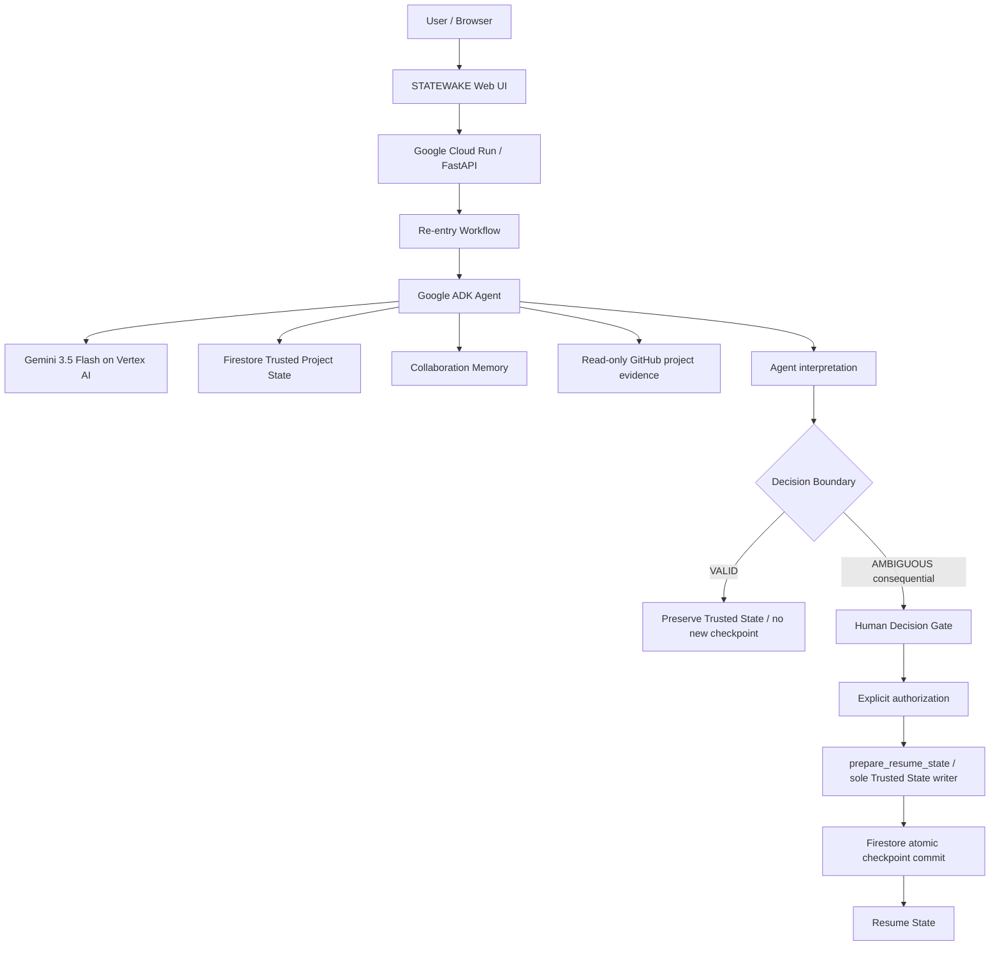

# STATEWAKE — Validate-before-Recover Agent Architecture

Evidence is observed. Findings are inferred. Trusted State is committed.
Memory is interpretation context only; it cannot override Trusted State or
authorize recovery. Evidence never replaces the human authority boundary.
